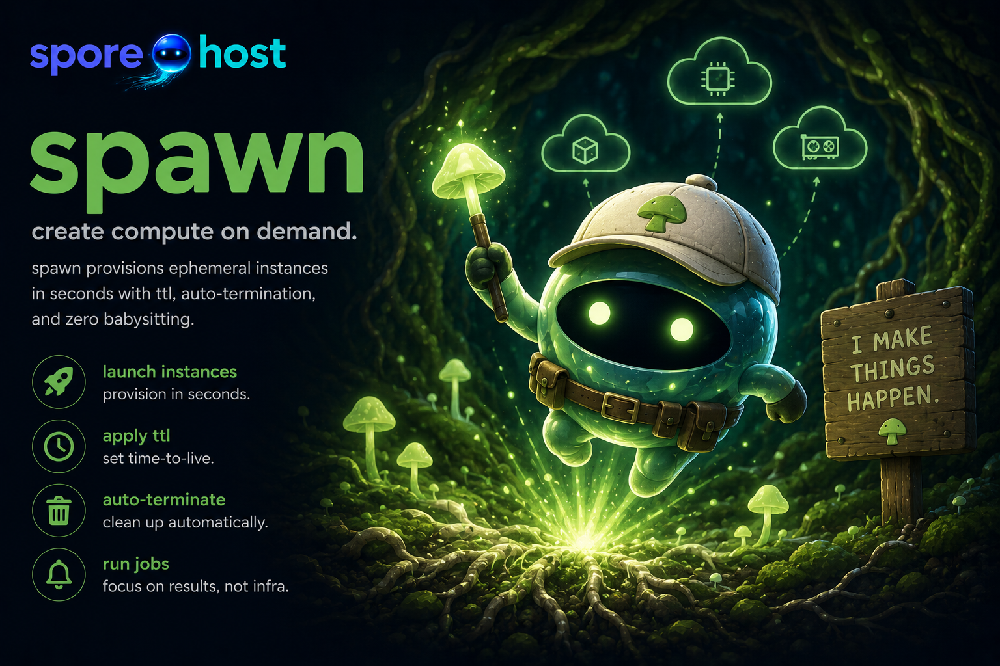

<p align="center">
  
</p>

# spawn

[](https://github.com/spore-host/spawn/actions/workflows/ci.yml)
[](https://codecov.io/gh/spore-host/spawn)
[](https://pkg.go.dev/github.com/spore-host/spawn)
[](LICENSE)
[](https://doi.org/10.5281/zenodo.21439888)

Launch and manage EC2 instances with automatic lifecycle management.

Instances terminate themselves via TTL, idle detection, or completion signal — no forgotten bills.

**Requires AWS credentials.**

## Installation

**macOS / Linux (Homebrew)**
```bash
brew install spore-host/tap/spawn
```

**Windows (Scoop)**
```powershell
scoop bucket add spore-host https://github.com/spore-host/scoop-bucket
scoop install spawn
```

**Debian / Ubuntu**
```bash
curl -LO https://github.com/spore-host/spawn/releases/latest/download/spawn_linux_amd64.deb
sudo dpkg -i spawn_linux_amd64.deb
```

**RHEL / Fedora**
```bash
sudo rpm -i https://github.com/spore-host/spawn/releases/latest/download/spawn_linux_amd64.rpm
```

**Direct download** — pre-built binaries for Linux, macOS, and Windows (amd64/arm64) on the [releases page](https://github.com/spore-host/spawn/releases/latest).

**Build from source**
```bash
git clone https://github.com/spore-host/spawn
cd spawn && make build && sudo make install
```

## Quick Start

```bash
# Launch with auto-terminate on completion
spawn launch my-job --instance-type c6a.xlarge --ttl 4h --on-complete terminate

# Connect by name (auto-starts if stopped)
spawn connect my-job

# Run a one-shot command
spawn connect my-job -- 'nohup bash /tmp/run.sh > /tmp/run.log 2>&1 &'

# Check status
spawn status my-job

# Extend TTL without reconnecting
spawn extend my-job 2h

# List all instances
spawn list
```

## Commands

| Command | Description |
|---------|-------------|
| `launch` | Launch an EC2 instance (Linux or Windows) |
| `connect` | Connect to an instance by name (auto-starts if stopped): SSH on Linux; RDP, PowerShell-over-SSM, or `--ssh` on Windows |
| `app` | Launch a streamed GUI app, a bare Linux desktop, or a self-serving web app ([see below](#launch-a-gui-or-web-app)) |
| `list` | List all managed instances |
| `status` | Instance status, TTL, cost |
| `extend` | Extend TTL on a running instance |
| `stop` / `start` | Stop or start an instance |
| `hibernate` | Hibernate (saves RAM to disk) |
| `terminate` | Terminate an instance (permanent — destroys the instance) |
| `image` | Build a custom AMI from a Windows ISO (EC2 Image Builder; auto-warms for fast boot) |
| `ami` | List / delete spawn-managed AMIs |
| `snapshot` | Build an EBS data snapshot from a directory, tarball, or raw image (for `launch --attach-volume`) |
| `queue` | Batch job queue management |
| `schedule` | Scheduled execution |
| `sweep` | Parameter sweeps |
| `cancel` | Cancel a running parameter sweep (`--sweep-id`) |
| `stage` | Data staging to/from S3 |
| `notify` | Chat notification (Slack/Teams) |
| `slurm` | Convert Slurm sbatch scripts |
| `resources` | List all AWS resources spawn has created (tagged `spawn:managed`) |
| `orphans` | Report spawn-managed resources that look abandoned (billable leaks) |
| `cleanup` | Remove orphaned spawn-managed resources |

### Conventions

- **Structured output:** use the root `-o`/`--output` flag (`-o json`) on any
  command. Per-command `--json` flags are deprecated aliases and will be
  removed; prefer `-o json`.
- **Destructive commands** (`cancel`, `terminate`, `delete`, `remove`) prompt
  for confirmation and accept `-y`/`--yes` to skip it (required for
  non-interactive use). A piped/non-interactive run without `--yes` aborts
  rather than acting.

See **[docs/flag-conventions.md](docs/flag-conventions.md)** for the full
convention reference (shared across spawn, truffle, lagotto, and spored).

### Bounding cost: stop vs terminate

TTL always **terminates** — it fully bounds cost. But the default *idle* action
(and `--on-complete stop`) only **stops** the instance, and a stopped instance
**keeps billing** for its EBS volumes and any attached Elastic IP, indefinitely.
For batch/headless workloads — especially in accounts without a hosted reaper —
prefer `--on-complete terminate` so completion fully releases the spend.

To find money quietly leaking:

```bash
spawn orphans          # billable leaks: detached volumes, stopped-instance EIPs, …
spawn cleanup --force  # remove them (never touches running instances)
```

`spawn status <instance>` also reports any Elastic IP attached to an instance —
informational while running, a billing warning while stopped. Note: spawn never
allocates an Elastic IP, so it never releases one; any EIP shown is a static
address you allocated, and it's yours to release with `aws ec2 release-address`.

## Launch a GUI or web app

`spawn app` launches a research application in the cloud and opens it in your
browser — no VNC/RDP client, no AMI to build. It streams a GUI app over an
[Amazon DCV](https://aws.amazon.com/hpc/dcv/) virtual session, or reverse-proxies
a web app straight to a `https://` URL. Instances self-terminate on idle/TTL just
like `spawn launch`.

```bash
# See what you can launch (public apps + anything your account can pull)
spawn app list

# 1. A single GUI app streamed to a browser tab (the default kind)
spawn app launch paraview            # e.g. ParaView, ChimeraX — on a GPU instance

# 2. A bare Linux desktop over DCV — "open a terminal and run anything"
spawn app launch desktop

# 3. A web app that serves its own UI on a port (Jupyter, code-server, …) — no DCV
spawn app launch my-jupyter --image 123456789012.dkr.ecr.us-east-1.amazonaws.com/jupyter --web-port 8888
```

**Three launch kinds** (set by the catalog entry's `kind`, or inferred):

- **`application`** *(default; also what `dcv: true` means)* — one Linux GUI app
  streamed over a DCV virtual session to a browser tab.
- **`desktop`** — a bare Linux desktop (GNOME) over DCV, no specific app;
  `spawn app launch desktop`.
- **`web`** — an app that serves its own web UI on a port (Jupyter, code-server,
  OpenRefine). No DCV: `spored` fronts it with a built-in TLS reverse proxy on
  `:443`. Launch a `web` catalog entry, or bring your own image ad hoc with
  `--image <ref> --web-port <n>` (add `--health-path` if readiness isn't at `/`).

**Prerequisites**

- AWS credentials — sign in with [`aws login`](https://spore.host/docs) (spore.host
  uses the AWS CLI's `login` command). No creds → `spawn app list` shows only the
  public apps.
- For GPU apps (most streamed GUI apps), a **GPU-instance quota** in the target
  region. The base image is the AWS GPU Deep Learning AMI, resolved via SSM at
  launch, with Amazon DCV installed at boot — there is no AMI to pre-build.

**What you get** — for a GUI app or desktop, `spawn` writes a session file under
`~/.spawn/sessions/` and opens it in your browser (the DCV client connects once
the session is ready); for a web app it prints and opens the `https://<host>/`
URL. Reconnect later with `spawn connect <instance>`. Useful flags:
`--instance-type`, `--region`, `--spot`, `--ttl 4h`, `--idle-timeout 20m`,
`--app-version <tag>`, and `--no-open` (write the session file / print the URL but
don't open a browser). The instance stops on idle and terminates at its TTL, so a
forgotten session doesn't keep billing.

To author or override catalog entries (your own images, an in-house app, or a
pinned AMI), see **[docs/catalog-schema.md](docs/catalog-schema.md)** and the
example overlay at **[docs/catalog-overlay.example.yaml](docs/catalog-overlay.example.yaml)**.

## spored

spored is the lifecycle daemon that runs inside each instance as a systemd service. It handles TTL enforcement, idle detection, completion signals, and DNS registration. It is built and distributed alongside spawn. As an on-instance CLI it follows the same flag conventions (subcommands `status`, `config get/set/list`, `reload`, `complete`, `version`).

## Go Library

`pkg/launcher` is the recommended entry point — it provisions a fully-functional
spore (auto-detects the AMI, sets up the spored IAM role, installs the spored
bootstrap so the instance honors TTL / idle / on-complete), the same way the CLI
does. SDK consumers like lagotto use it.

```go
import (
    "github.com/spore-host/spawn/pkg/aws"
    "github.com/spore-host/spawn/pkg/launcher"
)

client, _ := aws.NewClient(ctx)
result, _ := launcher.Provision(ctx, client, aws.LaunchConfig{
    InstanceType: "c6a.xlarge",
    Region:       "us-east-1",
    TTL:          "4h",
    OnComplete:   "terminate",
}, launcher.Options{})
```

For lower-level control, `client.Launch(ctx, config)` launches an instance
without the bootstrap — but then the spore won't self-manage; prefer `Provision`.

## Documentation

Full reference at **[spore.host/docs](https://spore.host/docs/tools/spawn)**.

- **[Windows beta guide](docs/windows-beta-guide.md)** — end-to-end: Windows 11
  ISO → custom (auto-warmed) AMI → launch → connect via RDP, PowerShell-over-SSM,
  or SSH.
- **[Reference data volumes](docs/reference-data-volumes.md)** — get large
  reference data (Kraken2 DB, BLAST index, model weights) onto spores without
  baking it into an AMI: `snapshot create` from a dir/tarball/raw image →
  `launch --attach-volume`.
- **[Service readiness contract](docs/service-readiness-contract.md)** — the one
  JSON line a long-lived HTTP service prints so `spawn service` knows which port
  to forward to. Read this to make a binary spawnable.

## License

Apache 2.0 — Copyright 2025-2026 Scott Friedman.
